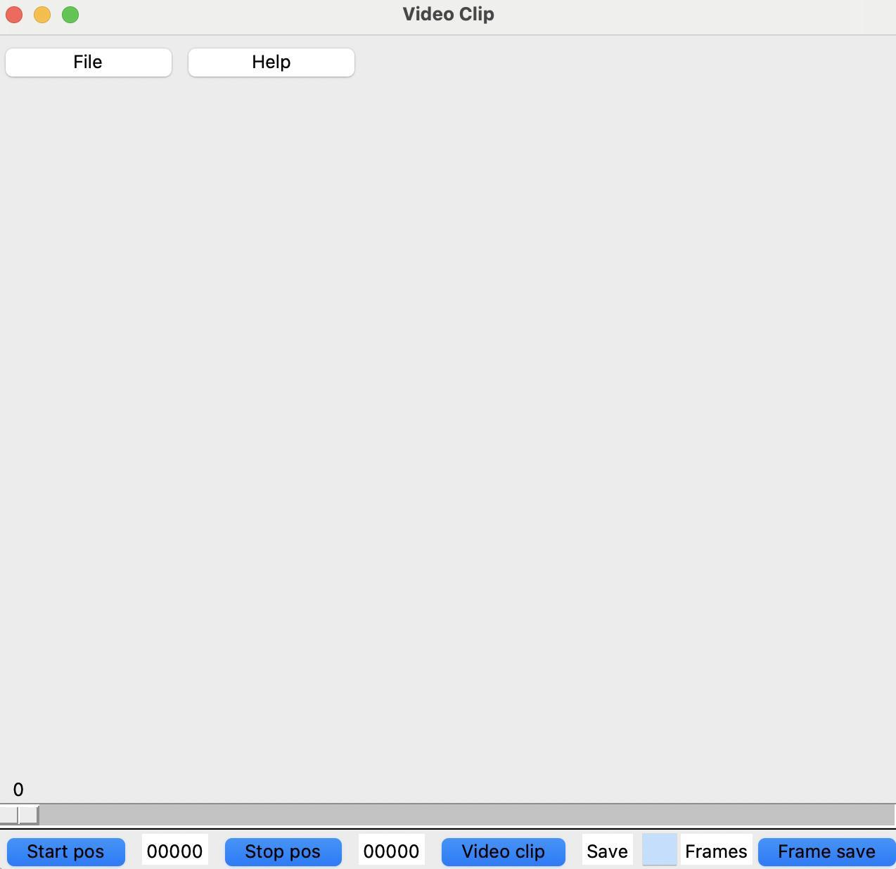
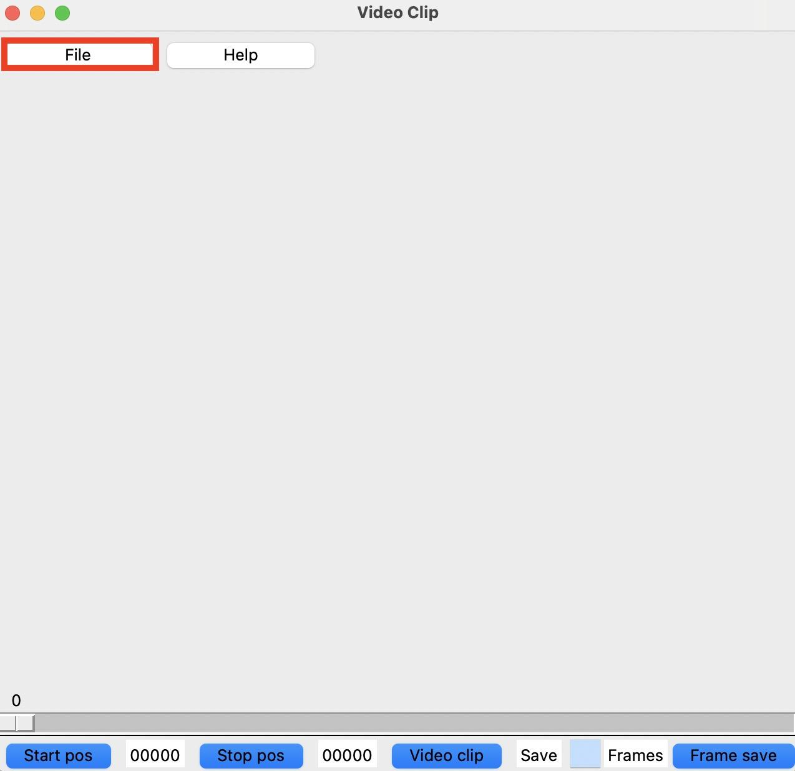
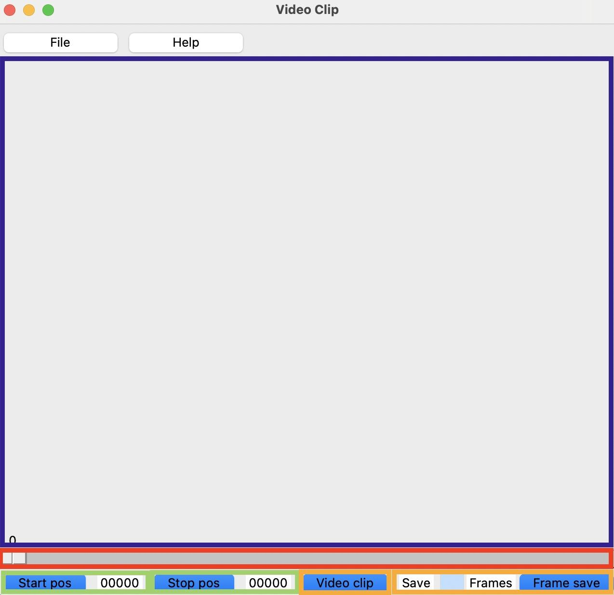

# Video Save Clip

## Overview
This code allows you to clip mp4 video file and to save frames in the video.


## Prerequisites
* Python>=3.8
* TKinter

## How to Install
After installing Python>=3.8, please run command below in your venv.
```bash
pip install -U pip setuptools build
python -m build
pip install dist/video_clip-1.0.0-py3-none-any.whl
```

## Usage
### App Run
Run the command below.
```bash
python -m video_clip.app_sample
```

### App Screen
A Window like below will be displayed.



### How to use it
1. Choose "File" button.


2. Choose a mp4 video you want to open on a filedialog.


3. The video frame will be show on a screen (In blue rectangle)


4. Change a displayed frame by using a slider or left/right key on keyboard (In red rectangle)

5. When the frame you want to start clipping video or saving frame appears, choose "Start pos" button (In green rectangle)

6. When the frame you want to stop clipping video or saving frame appears, choose "Stop pos" button (In green rectangle)

7. (In orange rectangle)
* If you want to clip video, choose "Video clip" button
* If you want to save frames, fillin the number of frames you want to save in textbox and push "Frame save" button

8. A video or frames will be saved in current directory

9. Press "q" key on keyboard when you want to quit

## TODO
* Use "help" combbox insted of "help" window
* Add video length info
* Change the place to store file name from controller to data
* Use tkinter progress bar when clipping/saving.
* Use input textbox in "Start pos" and "Stop pos" index.