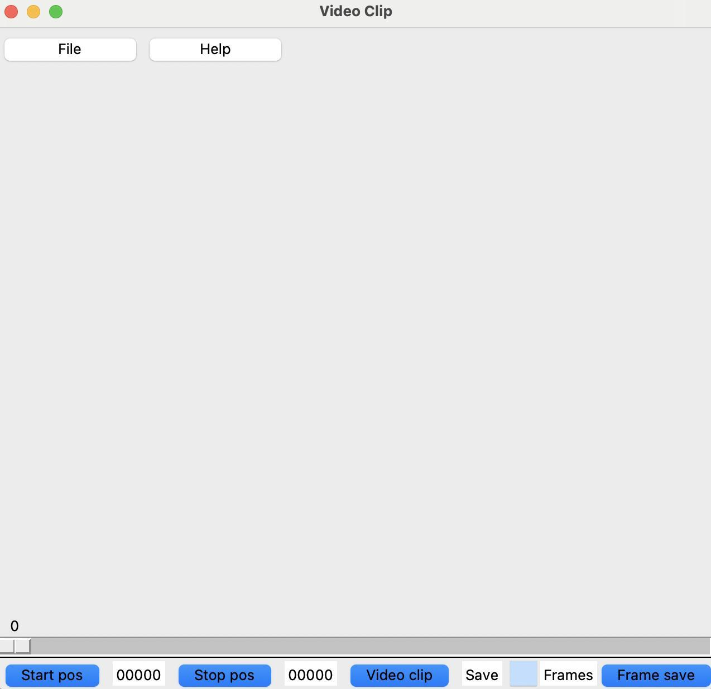
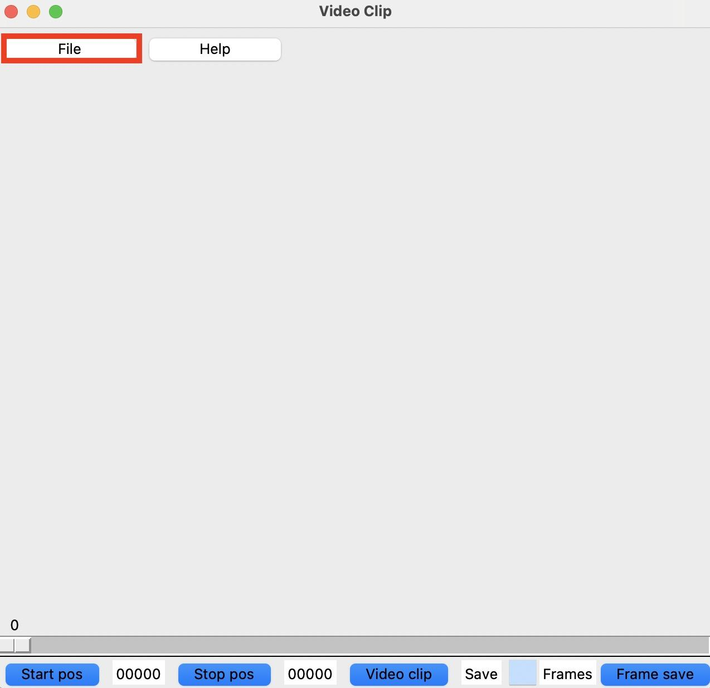

# Video Save Clip

言語: [英語](./README.md)/日本語

## 概要
このツールでは，mp4 動画ファイルを指定の区間で切り抜いたり，区間内のフレームを指定枚数保存することが可能です．

## 確認済み動作環境
* Mac
* Windows11 (バグ：開くためにコピーした tmp.mp4 の削除に失敗する)

## 前提
* Python>=3.8
* TKinter

## インストール方法
Python 3.8 以上をインストール後，venv 内などで下記のコマンドを実行
```bash
pip install -U pip setuptools build
python -m build
pip install dist/video_clip-1.0.0-py3-none-any.whl
```

## 操作方法
### アプリ起動
下記コマンドを実行
```bash
python -m video_clip.app_sample
```

### アプリ画面
下記のような画面が表示されます．



### 使い方
1. "File" ボタンを選択


2. ファイルダイアログが開くため，表示したい mp4 動画ファイルを選択する


3. 動画フレームが表示されます（青枠内）


4. スライダーまたはキーボードの左/右矢印キーで表示されるフレームを変更する（赤枠内）

5. 動画クリップまたはフレーム保存を開始したいフレームが表示されたら，"Start pos" を選択する（緑枠内）

6. 動画クリップまたはフレーム保存を終了したいフレームが表示されたら，"Stop pos" を選択する（緑枠内）

7. （オレンジ枠内）
* 動画クリップをしたい場合，"Video clip" を選択
* フレーム保存をしたい場合，テキストボックスに保存したい枚数を入力し，"Frame save" を選択

8. カレントディレクトリ内に，動画/フレームが保存される

9. アプリを終了するときは，"q" キーを押す

## TODO
[参照](./README.md#todo)